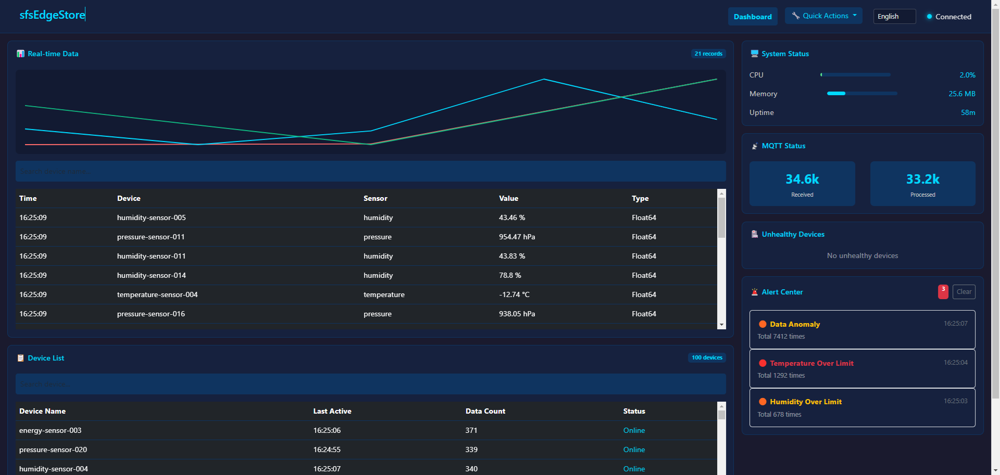

[English](./README.md) | [中文](./README_zh.md)

# sfsEdgeStore

Lightweight Industrial IoT Edge Data Storage Adapter for EdgeX Foundry.

> This project is built by the **official sfsDb team**, serving as the official edge computing adapter for sfsDb database.

## Data Sovereignty & Compliance

**sfsEdgeStore** follows a **local-first architecture** that ensures **full data sovereignty**. All data is stored locally on the edge device - no cloud dependency, no data transfer to third parties.

- **GDPR Compliant**: Data never leaves your premises. No cross-border data transfer.
- **EU Cyber Resilience Act Ready**: No dependency on external services.
- **Encryption at Rest**: AES-256 database encryption ensures data is unreadable without your keys.
- **Zero Vendor Lock-in**: Pure Go binary, embedded database, no external services required.

## ⚡ Performance

| Metric | Value | Description |
|--------|-------|-------------|
| **Memory** | ~14 MB | Ultra-lightweight, suitable for resource-constrained devices |
| **CPU** | <5% | Minimal overhead during normal operation |
| **Startup** | <0.2s | Fast startup, ready in milliseconds |
| **Database** | 0.25 MB / 18K records | Efficient storage with LevelDB |



## 🎯 Core Problem Solved

### Edge Computing Challenges

| Challenge | Solution |
|-----------|----------|
| Limited edge device resources | Memory <15MB, CPU <5%, ultra-lightweight |
| Data loss during network outages | Local storage, offline operation |
| Complex heavy database deployment | 5-minute deployment, zero configuration |
| EdgeX Foundry storage gap | Native EdgeX integration, seamless setup |
| Slow data query response | Local LevelDB, millisecond query response |
| Cloud dependency | Independent operation, no center system required |

## 📋 Product Overview

**sfsEdgeStore** is a lightweight data storage adapter designed for industrial IoT edge scenarios. It serves as a bridge between EdgeX Foundry and sfsDb, providing efficient local data read/write and caching capabilities.

### Why EdgeX Needs sfsEdgeStore

> EdgeX is the best connectivity framework, but it doesn't persist data by default. Don't use Redis (data loss on power failure), don't use InfluxDB (too heavy for edge). sfsEdgeStore is EdgeX's native storage plugin, designed for resource-constrained edge gateways.

## ✨ Key Features

- 📡 **MQTT Data Ingestion**: Subscribe to EdgeX Foundry event topics
- 💾 **Local Data Storage**: sfsDb/LevelDB for efficient edge data storage
- 🔒 **Data Encryption**: AES-256 encryption for data at rest
- 🔄 **Reliable Queue**: Power-failure recovery and data retry mechanism
- 📊 **Real-time Monitoring**: Built-in system and business metrics
- ⚠️ **Smart Alerts**: Threshold alerts and anomaly detection
- 🗑️ **Data Retention**: Automatic cleanup of expired data
- 🔐 **Authentication**: API Key and RBAC access control
- 🌐 **HTTP API**: RESTful interfaces for external queries
- 📦 **Backup & Restore**: Automated backup and recovery

## 🚀 Quick Start

### Prerequisites

- Go 1.21+ (for building from source)
- EdgeX Foundry (optional, for data source)
- MQTT Broker (e.g., Mosquitto)

### Method 1: Binary Deployment (Recommended)

```bash
# Download from GitHub Releases
# https://github.com/liaoran123/sfsEdgeStore/releases

# Run directly (for testing)
./sfsedgestore

# For production, use systemd (Linux) or Windows Service
```

### Method 2: Docker Compose (Recommended)

```bash
git clone https://github.com/liaoran123/sfsEdgeStore.git
cd sfsEdgeStore
docker-compose up -d
```

Starts sfsEdgeStore + MQTT Broker together. Access dashboard at `http://localhost:8081`.

### Method 3: Docker

```bash
docker run -d \
  --name sfsedgestore \
  -p 8081:8081 \
  -v ./data:/app/data \
  -v ./config.json:/app/config.json \
  liaoran123/sfsedgestore:latest
```

### Method 4: From Source

```bash
git clone https://github.com/liaoran123/sfsEdgeStore.git
cd sfsEdgeStore
go build -ldflags="-s -w" -o sfsedgestore .
./sfsedgestore
```

### Verify Installation

```bash
# Health check
curl http://localhost:8081/health

# Open Dashboard in browser
# http://localhost:8081
```

### Zero Configuration

sfsEdgeStore uses intelligent defaults. Start without any configuration:

| Setting | Default |
|---------|---------|
| MQTT Broker | `tcp://localhost:1883` |
| MQTT Topic | `edgex/events/#` |
| HTTP Port | `8081` |
| Database Path | `data` |

### Configuration Example

Create `config.json` to customize settings:

```json
{
  "mqtt_broker": "tcp://localhost:1883",
  "mqtt_topic": "edgex/events/#",
  "http_port": "8081",
  "db_path": "data",
  "db_scenario": "edge",
  "enable_resource_monitoring": true,
  "max_memory_mb": 256,
  "enable_retention_policy": true,
  "retention_days": 30
}
```

| Key | Description |
|-----|-------------|
| `mqtt_broker` | MQTT server address (e.g., Mosquitto) |
| `mqtt_topic` | EdgeX event topic pattern |
| `db_path` | Local database storage path |
| `db_scenario` | Performance profile: `embedded`, `iot`, `edge`, `game`, `default` |
| `enable_retention_policy` | Auto-cleanup old data |
| `retention_days` | Days to keep data before cleanup |

> MQTT Topic is managed through the **Topic Subscription** page (`http://localhost:8081/mqtt-subscription`) in the web dashboard.

## 🏗️ Architecture

### Lightweight Edge Architecture

```
┌─────────────────────────────────────────────────────────────┐
│                      Edge Node (Resource-Constrained)       │
│                                                             │
│  ┌───────────────────────────────────────────────────────┐ │
│  │              EdgeX Foundry                              │ │
│  │  (Data Collection, Device Management)                  │ │
│  └────────────────────┬──────────────────────────────────┘ │
│                       │ MQTT                              │
│                       ▼                                   │
│  ┌───────────────────────────────────────────────────────┐ │
│  │         sfsEdgeStore (Lightweight Adapter)             │ │
│  │  ┌──────────────┐  ┌──────────────┐  ┌──────────┐  │ │
│  │  │  MQTT Client  │→ │  Data Queue  │→ │  sfsDb   │  │ │
│  │  └──────────────┘  └──────────────┘  └──────────┘  │ │
│  │  ┌──────────────┐  ┌──────────────┐                  │ │
│  │  │  HTTP Server  │  │  Monitoring  │                  │ │
│  │  └──────────────┘  └──────────────┘                  │ │
│  └───────────────────────────────────────────────────────┘ │
│                       │ HTTP API                         │
└───────────────────────┼─────────────────────────────────────┘
                        ▼
                  External Query/Monitoring
```

### Design Principles

- **Small and Beautiful**: Does one thing, does it perfectly
- **Data Sovereignty**: Data stays local. No cloud dependency.
- **Edge First**: All features prioritize edge scenarios
- **Zero Dependencies**: Only depends on sfsDb, no heavy components
- **High Availability**: Power-failure recovery, data retry, local storage

## 📚 Documentation

Complete documentation available in the [docs](./docs/) directory:

| Document | Description |
|----------|-------------|
| [Quick Start](./docs/quick-start.md) | Get started in 5 minutes |
| [Installation](./docs/installation.md) | Installation and deployment guide |
| [API Reference](./docs/api-reference.md) | REST API documentation |
| [Configuration](./docs/configuration.md) | All configuration options |
| [Architecture](./docs/architecture.md) | System architecture overview |
| [Security](./docs/security.md) | Authentication, TLS, encryption |
| [Troubleshooting](./docs/troubleshooting.md) | Common issues and solutions |

📖 [View Documentation Index](./docs/README.md)

## 💼 Pricing & Licensing

| Edition | Price | Device Limit | Support | Updates |
|---------|-------|-------------|---------|---------|
| 🆓 **Community** | Free | 5 devices | Community | ❌ |
| 💼 **Business** | $299/year | 50 devices | Email (72h) | ✅ |
| 🚀 **Enterprise** | $799/year | Unlimited | Priority (48h) | ✅ |

> Subscription includes: complete documentation, email support, security updates, and new features.

See [Licensing Guide](./docs/licensing.md) for details.

## 🤝 Contributing

Welcome to submit Issues and Pull Requests!

Please see [CONTRIBUTING.md](./CONTRIBUTING.md) for contribution guidelines.

## 🔒 Security

Please see [SECURITY.md](./SECURITY.md) for security policy and vulnerability reporting.

## 📄 License

Apache License 2.0

## 🙏 Acknowledgments

- [EdgeX Foundry](https://www.edgexfoundry.org/)
- [sfsDb](https://github.com/liaoran123/sfsDb)
- [Eclipse Paho MQTT](https://www.eclipse.org/paho/)
