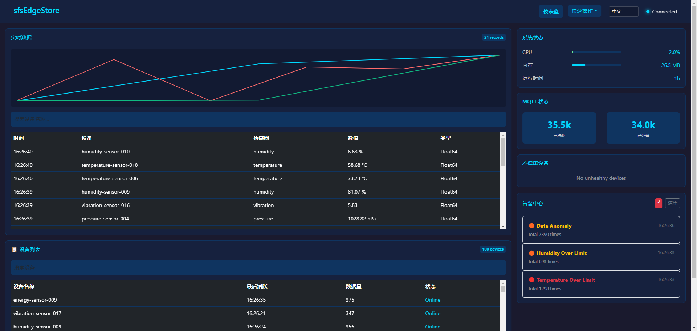
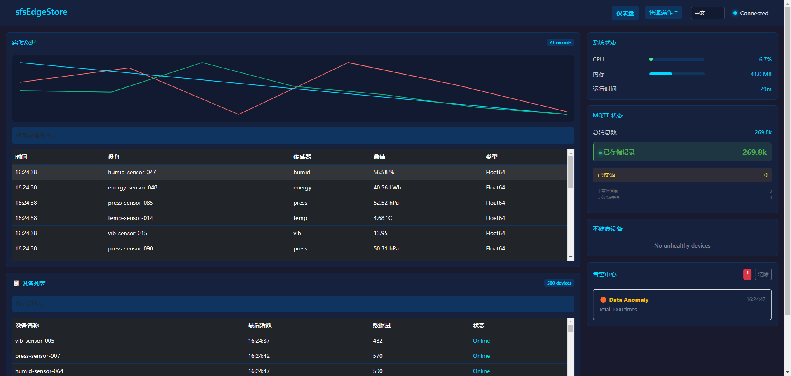

# sfsEdgeStore

轻量级工业物联网边缘数据存储适配器，专为 EdgeX Foundry 设计。

> 本项目由 **sfsDb 官方团队** 精心打造，作为 sfsDb 数据库的官方边缘计算适配器。

### 性能表现

#### 生产环境（100设备）
- **内存**：~30MB（稳定运行）
- **CPU**：1.7%（超低功耗）
- **消息速率**：~30条/秒（真实工业数据）
- **启动时间**：<0.2秒（毫秒级启动）

#### 高压测试（500设备）
- **内存**：~44MB（4000条/秒负载）
- **CPU**：6.8%（应对极端负载）
- **消息速率**：~4000条/秒（133倍生产负载）
- **数据可靠性**：100%无丢失




## 🎯 解决的核心问题

### 边缘计算挑战

| 挑战                 | 解决方案                   |
| ------------------ | ---------------------- |
| 边缘设备资源有限           | 内存 <15MB，CPU <5%，超轻量设计 |
| 网络中断时数据丢失          | 本地存储，断网正常运行            |
| 重型数据库部署复杂          | 5 分钟部署，零配置             |
| EdgeX Foundry 存储缺失 | 原生 EdgeX 集成，开箱即用       |
| 数据查询响应慢            | 本地 LevelDB，毫秒级查询       |
| 依赖云端               | 独立运行，无需中心系统            |

## 📋 产品简介

**sfsEdgeStore** 是专为工业物联网边缘场景设计的轻量级数据存储适配器，作为 EdgeX Foundry 和 sfsDb 之间的桥梁，提供高效的本地数据读写和缓存能力。

### 为什么 EdgeX 需要 sfsEdgeStore

> EdgeX 是最好的连接框架，但它默认不存数据。别用 Redis（断电丢数据），别用 InfluxDB（边缘太卡）。sfsEdgeStore 是 EdgeX 的原生存储插件，专为资源受限的边缘网关设计。

## ✨ 核心功能

- 📡 **MQTT 数据接入**：订阅 EdgeX Foundry 事件主题
- 💾 **本地数据存储**：sfsDb/LevelDB 高效边缘存储
- 🔒 **数据加密**：AES-256 静态数据加密
- 🔄 **可靠队列**：断电恢复与数据重试机制
- 📊 **实时监控**：内置系统与业务指标监控
- ⚠️ **智能告警**：阈值告警与异常检测
- 🗑️ **数据保留**：自动清理过期数据
- 🔐 **认证授权**：API Key 与 RBAC 访问控制
- 🌐 **HTTP API**：RESTful 接口供外部查询
- 📦 **备份恢复**：自动备份与恢复功能

## 🚀 快速开始

### 适用场景

本方案专为 **ARM边缘网关**（256MB/512MB内存）设计，支持：
- 工业Modbus设备数据采集
- 断网缓存（支持7天离线运行）
- 固件授权激活

### 前置条件

- ARM网关（推荐：256MB+内存）
- MQTT Broker（如 Mosquitto）
- EdgeX Foundry（可选，数据源）

### 方式一：固件部署到ARM网关（推荐）

```bash
# 下载预编译固件（支持常见ARM架构）
wget https://github.com/liaoran123/sfsEdgeStore/releases/download/v1.0/sfsedgestore_armhf.tar.gz

# 解压并运行
tar -zxvf sfsedgestore_armhf.tar.gz
cd sfsedgestore
./sfsedgestore

# 或设置为系统服务
cp sfsedgestore /usr/local/bin/
cp sfsedgestore.service /etc/systemd/system/
systemctl enable sfsedgestore
systemctl start sfsedgestore
```

### 方式二：交叉编译（开发用）

```bash
# 针对ARM架构交叉编译
git clone https://github.com/liaoran123/sfsEdgeStore.git
cd sfsEdgeStore

# 编译 ARMv7（树莓派等）
GOOS=linux GOARCH=arm GOARM=7 go build -ldflags="-s -w" -o sfsedgestore .

# 编译 ARM64（高端网关）
GOOS=linux GOARCH=arm64 go build -ldflags="-s -w" -o sfsedgestore .
```

### 方式三：Docker Compose（测试/开发）

```bash
git clone https://github.com/liaoran123/sfsEdgeStore.git
cd sfsEdgeStore
docker-compose up -d
```

### 验证安装

```bash
# 健康检查
curl http://localhost:8081/health

# 在浏览器中打开仪表板
# http://localhost:8081

# 查看设备状态
curl http://localhost:8081/api/devices/status
```

### 授权激活

首次运行需要激活授权：

```bash
# 通过Web界面激活
# 访问 http://localhost:8081/activate
# 输入CPU序列号绑定的授权码

# 或通过API激活
curl -X POST http://localhost:8081/api/auth/activate \
  -H "Content-Type: application/json" \
  -d '{"serial_number": "your-device-serial", "license_key": "your-license-key"}'
```

### 零配置启动

sfsEdgeStore 使用智能默认值，无需配置即可启动：

| 配置项         | 默认值                    |
| ----------- | ---------------------- |
| MQTT Broker | `tcp://localhost:1883` |
| MQTT 主题     | `edgex/events/#`       |
| HTTP 端口     | `8081`                 |
| 数据库路径       | `data`                 |

### 配置示例

创建 `config.json` 自定义配置：

```json
{
  "mqtt_broker": "tcp://localhost:1883",
  "mqtt_topic": "edgex/events/#",
  "http_port": "8081",
  "db_path": "data",
  "db_scenario": "edge",
  "enable_resource_monitoring": true,
  "max_memory_mb": 256,
  "enable_retention_policy": true,
  "retention_days": 30
}
```

| 配置项                       | 说明                                            |
| ------------------------- | --------------------------------------------- |
| `mqtt_broker`             | MQTT 服务器地址（如 Mosquitto）                       |
| `mqtt_topic`              | EdgeX 事件主题模式                                  |
| `db_path`                 | 本地数据库存储路径                                     |
| `db_scenario`             | 性能配置：`embedded`、`iot`、`edge`、`game`、`default` |
| `enable_retention_policy` | 自动清理过期数据                                      |
| `retention_days`          | 数据保留天数                                        |

> MQTT 主题通过 Web 仪表板的 **主题订阅** 页面（`http://localhost:8081/mqtt-subscription`）管理。

## 🏗️ 架构设计

### 轻量级边缘架构

```
┌─────────────────────────────────────────────────────────────┐
│                      边缘节点（资源受限）                     │
│                                                             │
│  ┌───────────────────────────────────────────────────────┐ │
│  │              EdgeX Foundry                              │ │
│  │  （数据采集、设备管理）                                  │ │
│  └────────────────────┬──────────────────────────────────┘ │
│                       │ MQTT                              │
│                       ▼                                   │
│  ┌───────────────────────────────────────────────────────┐ │
│  │         sfsEdgeStore（轻量级适配器）                     │ │
│  │  ┌──────────────┐  ┌──────────────┐  ┌──────────┐  │ │
│  │  │  MQTT 客户端  │→ │  数据队列    │→ │  sfsDb   │  │ │
│  │  └──────────────┘  └──────────────┘  └──────────┘  │ │
│  │  ┌──────────────┐  ┌──────────────┐                  │ │
│  │  │  HTTP 服务   │  │  监控告警    │                  │ │
│  │  └──────────────┘  └──────────────┘                  │ │
│  └───────────────────────────────────────────────────────┘ │
│                       │ HTTP API                         │
└───────────────────────┼─────────────────────────────────────┘
                        ▼
                  外部查询/监控
```

### 设计原则

- **小而美**：只做一件事，做到极致
- **数据主权**：数据留在本地，不依赖云端
- **边缘优先**：所有功能优先考虑边缘场景
- **零依赖**：仅依赖 sfsDb，无重型组件
- **高可用**：断电恢复、数据重试、本地存储

## 📚 文档

完整文档请查看 [docs](./docs/) 目录：

| 文档                                | 说明            |
| --------------------------------- | ------------- |
| [快速开始](./docs/quick-start.md)     | 5 分钟上手        |
| [安装指南](./docs/installation.md)    | 安装与部署         |
| [API 参考](./docs/api-reference.md) | REST API 文档   |
| [配置参考](./docscn/配置参考.md)          | 所有配置项（中文）     |
| [系统架构](./docs/architecture.md)    | 架构概览          |
| [安全指南](./docscn/安全指南.md)          | 认证、TLS、加密（中文） |
| [故障排查](./docscn/故障排查.md)          | 常见问题（中文）      |

## 💰 商业授权

sfsEdgeStore 提供灵活的商业授权方案，支持个人开发者和企业客户：

| 授权类型 | 定价 | 授权期限 | 适用场景 |
|---------|------|---------|---------|
| **散单授权** | 50元/台 | 永久授权 | 个人客户、小批量采购 |
| **批量授权** | 20~30元/台 | 永久授权 | 网关工厂、集成商批量预装 |
| **企业定制** | 按需报价 | 永久授权 | 定制开发、专属支持 |


#### 技术服务

作为个人开发者，我提供以下技术服务：

| 服务       | 说明               |
| -------- | ---------------- |
| **固件定制** | 适配特定硬件网关，定制采集协议 |
| **技术支持** | 优先邮件支持、部署协助、故障排查 |
| **方案咨询** | 评估边缘计算需求，设计最优架构  |

**联系：** <sfsweb@qq.com>


## 🤝 贡献

欢迎提交 Issue 和 Pull Request！

请查看 [CONTRIBUTING.md](./CONTRIBUTING.md) 了解贡献指南。

## 🔒 安全

请查看 [SECURITY.md](./SECURITY.md) 了解安全策略和漏洞报告方式。

## 📄 许可证

Apache License 2.0

## 🙏 致谢

- [EdgeX Foundry](https://www.edgexfoundry.org/)
- [sfsDb](https://github.com/liaoran123/sfsDb)
- [Eclipse Paho MQTT](https://www.eclipse.org/paho/)

